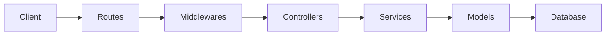
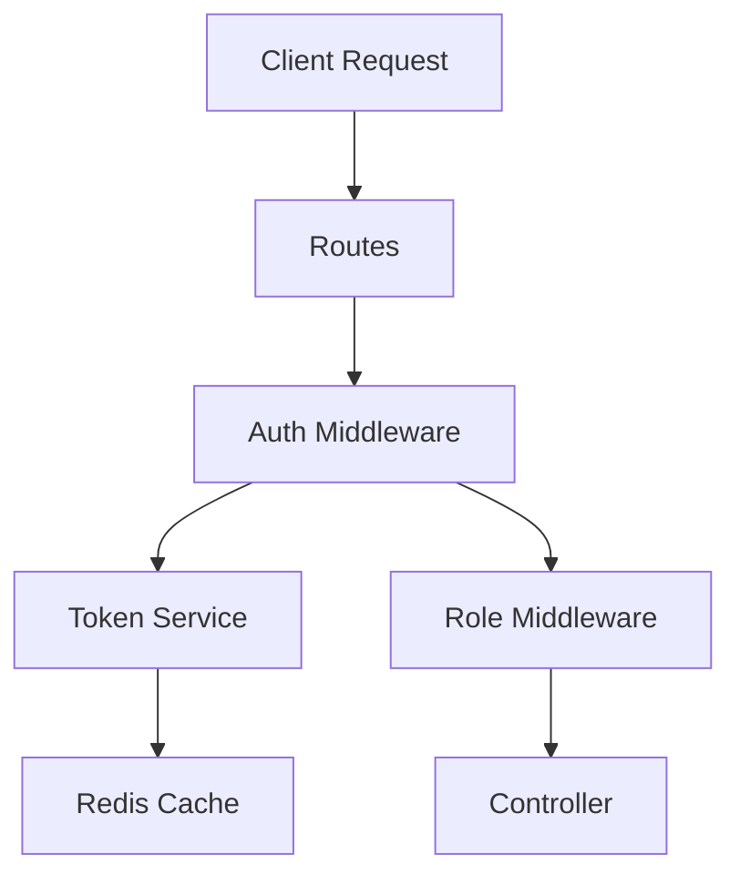
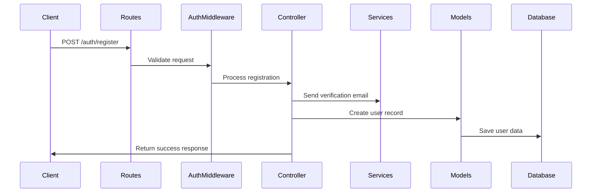
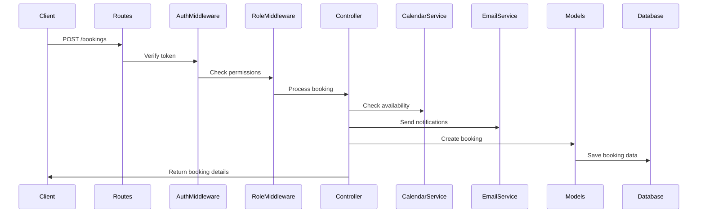

# Application Architecture

## Overview

TutorHUB is built using a modular architecture where each component has a specific responsibility and interacts with other components in a well-defined way. This document explains how the different parts of the application work together.

## Component Interaction Flow

### 1. Request Flow



### 2. Authentication Flow



## Component Responsibilities

### Routes (`/routes`)

- Entry points for all HTTP requests
- Defines API endpoints and their HTTP methods
- Routes requests to appropriate controllers
- Applies middleware chains
- Example flow:
  1. Receives HTTP request
  2. Validates request format
  3. Applies authentication middleware
  4. Routes to controller

### Middlewares (`/middlewares`)

- Intercepts requests before they reach controllers
- Handles cross-cutting concerns
- Common responsibilities:
  1. Authentication verification
  2. Role-based access control
  3. Request validation
  4. Error handling
  5. File upload processing

### Controllers (`/controllers`)

- Contains business logic
- Processes requests and generates responses
- Interacts with services and models
- Handles:
  1. Request validation
  2. Business logic execution
  3. Response formatting
  4. Error handling

### Services (`/services`)

- Provides reusable business logic
- Handles external service integrations
- Manages:
  1. Token operations
  2. Email sending
  3. Calendar management
  4. Caching operations

### Models (`/models`)

- Defines data structure and relationships
- Handles database operations
- Manages:
  1. Data validation
  2. Schema definitions
  3. Database queries
  4. Data relationships

### Config (`/config`)

- Manages application configuration
- Handles:
  1. Database connections
  2. External service configurations
  3. Environment variables
  4. OAuth settings

## Data Flow Examples

### 1. User Registration Flow



### 2. Booking Creation Flow



## Component Dependencies

### Direct Dependencies

- Routes depend on Controllers and Middlewares
- Controllers depend on Services and Models
- Services depend on Config
- Models depend on Config

### Indirect Dependencies

- Routes indirectly depend on Services through Controllers
- Controllers indirectly depend on Config through Services and Models
- Middlewares indirectly depend on Services through Controllers

## Best Practices

### 1. Request Handling

- Always validate input at the route level
- Use middleware for common operations
- Keep controllers focused on business logic
- Handle errors consistently

### 2. Data Flow

- Use services for reusable logic
- Keep models focused on data operations
- Use transactions for related operations
- Implement proper error handling

### 3. Security

- Implement authentication at middleware level
- Use role-based access control
- Validate all inputs
- Sanitize all outputs

### 4. Performance

- Use caching where appropriate
- Implement proper database indexing
- Optimize database queries
- Use connection pooling

## Common Patterns

### 1. Authentication Pattern

```javascript
// Route definition
router.post("/login", authMiddleware, authController.login);

// Middleware
const authMiddleware = (req, res, next) => {
  // Verify token
  // Attach user to request
};

// Controller
const login = async (req, res) => {
  // Process login
  // Generate tokens
  // Send response
};
```

### 2. Service Pattern

```javascript
// Service definition
const emailService = {
  sendVerificationEmail: async (user) => {
    // Generate token
    // Send email
  },
};

// Controller usage
const register = async (req, res) => {
  // Create user
  // Send verification email
};
```

### 3. Model Pattern

```javascript
// Model definition
const User = mongoose.model("User", {
  email: String,
  password: String,
  role: String,
});

// Controller usage
const createUser = async (userData) => {
  // Create user instance
  // Save to database
};
```

## Error Handling

### 1. Global Error Handler

```javascript
// Error middleware
const errorHandler = (err, req, res, next) => {
  // Log error
  // Format response
  // Send error
};
```

### 2. Validation Errors

```javascript
// Validation middleware
const validateRequest = (schema) => {
  return (req, res, next) => {
    // Validate request
    // Handle errors
  };
};
```

## Testing Strategy

### 1. Unit Tests

- Test individual components
- Mock dependencies
- Focus on business logic

### 2. Integration Tests

- Test component interactions
- Test database operations
- Test external services

### 3. End-to-End Tests

- Test complete flows
- Test user interactions
- Test error scenarios
